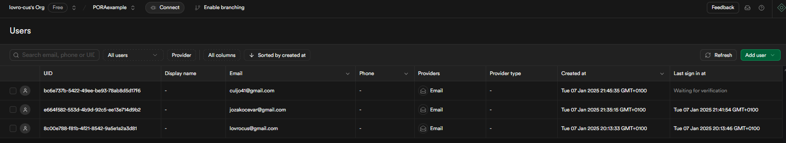
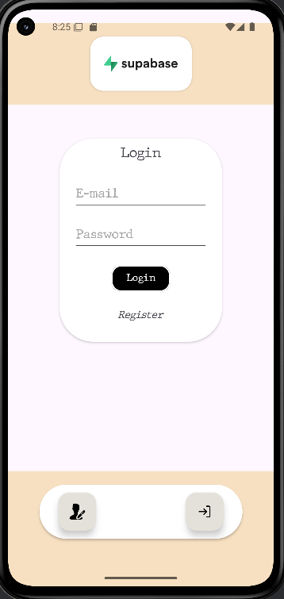
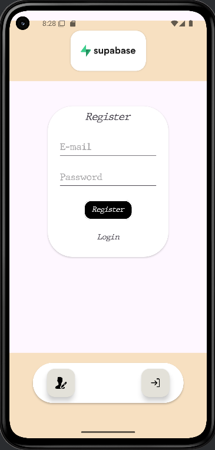
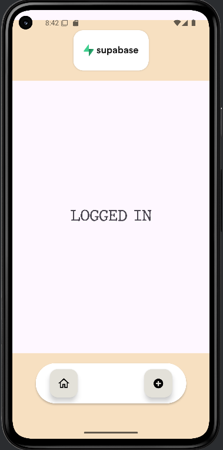

# Supabase Auth Demo App

Ta projekt prikazuje uporabo **Supabase Auth-KT knjižnice** za avtentikacijo uporabnikov v Android aplikaciji. Implementirani so osnovne funkcionalnosti, kot so **registracija**, **prijava** in **odjava** z uporabo **Ktor** odjemalca.

---

## 📚 Viri

- [Supabase Auth-KT GitHub Repository](https://github.com/supabase-community/supabase-kt/tree/master/Auth)
- [Uradna Supabase dokumentacija za Kotlin](https://supabase.com/docs/reference/kotlin/auth-signup)

---

## 🔧 Zahteve

- **Supabse 3.0.0** ali novejše
- **Kotlin 1.8.0** ali novejši
- **Gradle verzija 8.0+**
- **Supabase API ključ** (pridobljen iz [Supabase nadzorne plošče](https://supabase.com))
- **Internetna povezava** 

---

## 📦 Odvisnosti

```kotlin
dependencies {
    implementation("io.github.jan-tennert.supabase:auth-kt:VERSION")
}
```
##  ⬇️ Prenos
```kotlin
val supabase = createSupabaseClient(
    supabaseUrl = "https://id.supabase.co",
    supabaseKey = "apikey"
) {

    //...

    install(Auth) {
        // settings
    }

}
```

## 🔑 Dovoljenja

```xml
<manifest xmlns:android="http://schemas.android.com/apk/res/android"  
    xmlns:tools="http://schemas.android.com/tools">
    
        -
        -
        -
                
    <uses-permission android:name="android.permission.INTERNET"/>

        -
        -
        -
        
</manifest>
```


## ❓ Zakaj?

# Supabase Auth predstavlja odprtokodno alternativo storitvam, kot je Firebase Auth, z glavno prednostjo v enostavni integraciji in možnosti samo-gostovanja.

- **Prednosti**
  - **Enostavna integracija**
  - **Podpora različnim načinom prijave**
  - **Odprtokodnost (možnost self-hosting)**
  - **Skupnost in ekosistem**
- **Slabosti**
  - **Relativno mlada platforma**
  - **Nujna poštna storitev (za magic link in podobno)**

## Licenca
# Odprtokoden, pod licenco Apache 2.0

## UPORABA
- **Dodamo novega uporabnika [Register]**
```kotlin
val user = supabase.auth.signUpWith(Email) {
    email = "example@email.com"
    password = "example-password"
}

val user = supabase.auth.signUpWith(Email) {
    email = "example@email.com"
    password = "example-password"
    data = buildJsonObject {
        put("first_name", "John")
        put("age", 24)
    }
}

```

- **Prijavimo uporabnika [Log in]**
```kotlin
supabase.auth.signInWith(Email) {
    email = "example@email.com"
    password = "example-password"
}
```
Po prijavi, Supabase pošlje mail na katerem je potrebno potrditi, če ga ne potrdimo ni veljaven



- **Odjavimo uporabnika [Sign out]**
```kotlin
supabase.auth.signOut()
```

- **Spremenimo podatke uporabniku**
```kotlin
val user = supabase.auth.updateUser {
    email = "newEmail@email.com"
}

val user = supabase.auth.updateUser {
    password = "secretPassword"
}

val user = supabase.auth.updateUser {
    data {
        put("name", "John")
    }
}
```

- **Preverimo če je uporabnik prijavljen**
```kotlin
val session = supabase.auth.currentSessionOrNull()
```

- **Pridobimu uporabnika iz trenutne seje**
```kotlin
val user = supabase.auth.retrieveUserForCurrentSession(updateSession = true)

``````
## Admin
*Kot admin lahko sami upravljamo uporabnike, nekaj osnovnih funkcij:*
```kotlin
val supabase = createSupabaseClient(
    supabaseUrl = "https://id.supabase.co",
    supabaseKey = "supabaseKey"
) {
    install(Auth) {
        minimalSettings() //disables session saving and auto-refreshing
    }
    // install other plugins (these will use the service role key)
}
supabase.auth.importAuthToken("service_role")

// Access auth admin api
val adminAuthClient = supabase.auth.admin
```
-**Funkcije ki jih lahko izvajamo kot admin**

```kotlin
val user = supabase.auth.admin.retrieveUserById(uid = "f2a0b0a0-6b1a-4b7a-8f1a-4b7a6b1a8f1a") //Pridobimo uporabinika po ID-ju

val users = supabase.auth.admin.retrieveUsers() //Pridobim vse uporabnike

val userWithEmail = supabase.auth.admin.createUserWithEmail { //Kreiramo uporabnika
    email = "example@email.com"
    password = "secretpassword"
    userMetadata {
        put("name", "John")
    }
}

supabase.auth.admin.deleteUser(uid = "uid") //Izbrišemo uporabnika


supabase.auth.admin.updateUserById(uid = "id") { //Posodobimo uporabnika
    email = "example@email.com"
}
// itd..
```

## Aplikacija:


